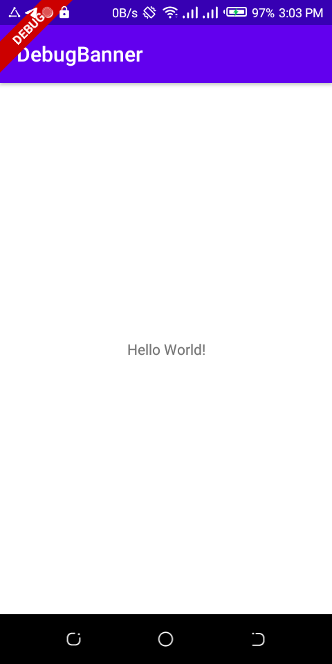
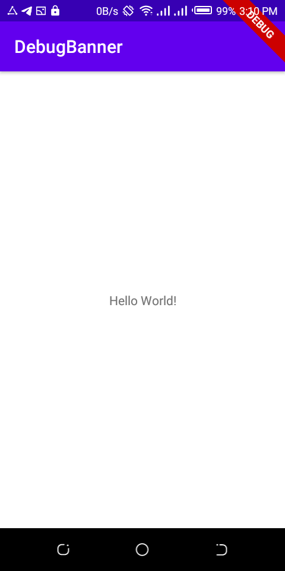
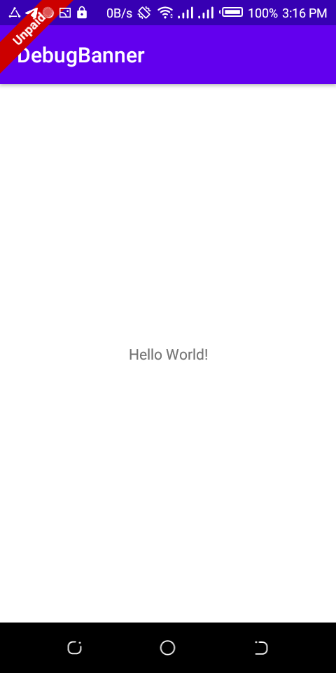

# DebugBanner
banner to be embedded in Native apps. check out the origional project [here](https://github.com/armcha/DebugBanner?utm_source=android-arsenal.com&utm_medium=referral&utm_campaign=7090)

## Screenshots



## Installation
first add Jitpack to your project
```groovy
allprojects {
    repositories {
        maven { url 'https://jitpack.io' }
    }
}
```

Add the dependency

```groovy
dependencies {
    implementation 'com.github.YohannesTz:DebugBanner:0.0.1'
}
```

## Usage
inside your Application class

```kotlin
DebugBanner.init(application = this)
```

## Customization

```kotlin
DebugBanner.init(application = this, banner = Banner(bannerText = "BETA"))
```

## Usage inside an Activity

```kotlin

class BannerActivity : AppCompatActivity(), BannerView {
    override fun onCreate(savedInstanceState: Bundle?) {
        super.onCreate(savedInstanceState)
        setContentView(R.layout.activity_banner)
    }

    override fun createBanner(): Banner {
        return Banner(
            bannerText = "Unpaid",
            bannerGravity = BannerGravity.START
        )
    }
}
```

## Copyright notice
DebugBanner
Copyright (c) 2018 Arman Chatikyan (https://github.com/armcha/DebugBanner).

Licensed under the Apache License, Version 2.0 (the "License");
you may not use this file except in compliance with the License.
You may obtain a copy of the License at

     http://www.apache.org/licenses/LICENSE-2.0

Unless required by applicable law or agreed to in writing, software
distributed under the License is distributed on an "AS IS" BASIS,
WITHOUT WARRANTIES OR CONDITIONS OF ANY KIND, either express or implied.
See the License for the specific language governing permissions and
limitations under the License.